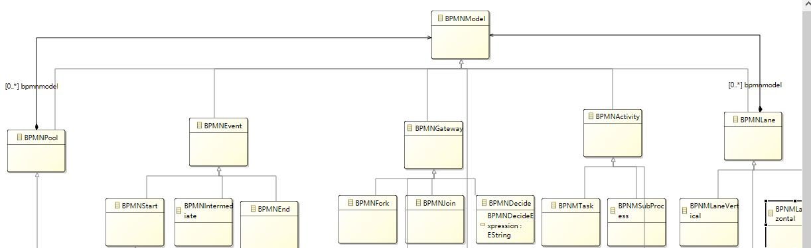
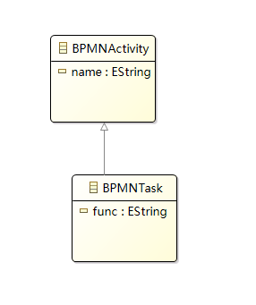
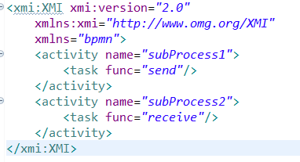
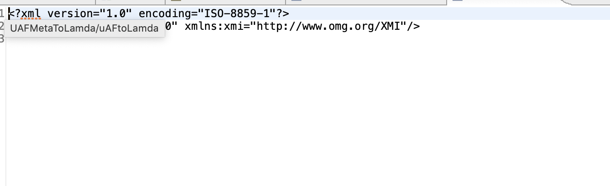
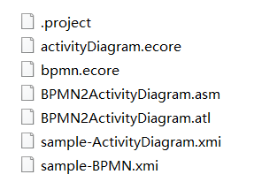

# 结果演示

SY2121113 任婷伊

## 输入模型元模型（BPMN业务流程图）

##  输出模型元模型（UML活动图）

## 转化关系

| BPMN       | activity diagram |    说明  |
| ---------- | ---------------- | ---- |
| Fork       | ForkNode         | 分叉 |
| Join       | JoinNode         | 合并 |
| FlowObject | ActivityEdge     | 流 |
| Decide     | DecisionNode     | 判断 |
| Process    | ActivityNode     | 活动节点 |
| Start      | InitialNode      | 开始 |
| End        | FinalNode        | 结束 |

### 输入XMI

### 输出XMI

## 项目源码

见/ATL/任婷伊-SY2121113/ATL
