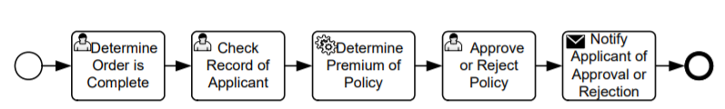
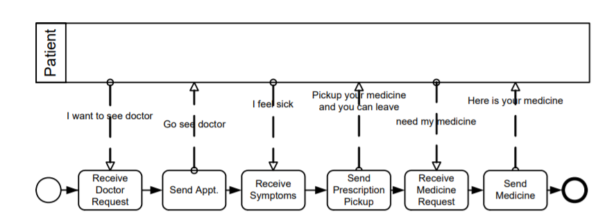
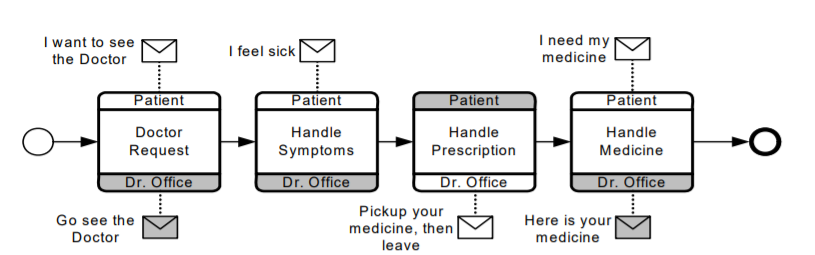
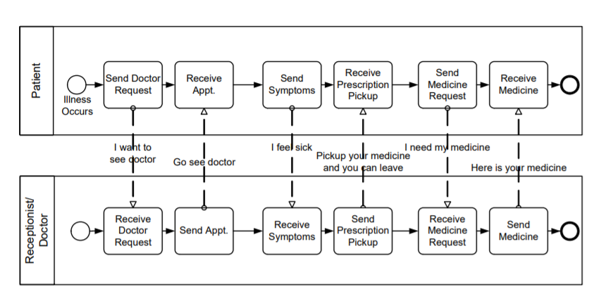

# 作业一：BPMN

## BPMN简介

OMG开发了标准的**业务流程模型和标记法** (BPMN—Business Process Model and Notation)，并借鉴了许多现有符号的专业知识和经验，比如UML 活动图、UML EDOC 业务流程、IDEF、ebXML BPSS、活动-决策流 (ADF) 图。

 BPMN 的主要目标是提供一种所有业务用户都易于理解的符号，包括创建流程初始草案的业务分析师、负责实现流程的技术开发人员，以及管理和监控流程的业务人员。因此，BPMN 为业务流程设计和流程实现之间的差距创建了一个标准化的桥梁。在面对许多不同的建模符号和观点时， BPMN 标准化了业务流程模型和符号，BPMN 将提供一种将流程信息传达给其他业务用户、流程实施者、客户和供应商的简单方法。

另一个同样重要的目标是确保设计用于执行业务流程的 XML 语言可以使用面向业务的符号进行可视化。

## BPMN用途

业务流程建模用于向各种各样的受众传达各种各样的信息。BPMN 旨在涵盖多种类型的建模，并允许创建端到端的业务流程。 BPMN 的结构元素使查看者能够轻松区分 BPMN 图表的各个部分。 端到端 BPMN 模型中有三种基本类型的子模型：

1. 流程（ Processes），包括：
   • 私有的不可执行（内部）业务流程
   • 私有可执行（内部）业务流程
   • 公共流程
2. 编排（Choreographies）
3. 协作（Collaborations），包括流程和/或编排
   • 对话视图

私有流程举例：

公共流程举例：

编排举例：

协作举例：

## BPMN图类型

BPMN 2.0 旨在涵盖流程的三个基本模型：私有流程（可执行和不可执行）、公共流程和编排。在这三个 BPMN 子模型之内和之间，可以创建多种类型的图表。以下是可以使用 BPMN 2.0 建模的业务流程示例：

- 高级非可执行流程活动（不是功能分解）
- 详细的可执行业务流程
- 原样或旧业务流程
-  未来或新的业务流程
-  对两（2）个或更多业务参与者之间预期行为的描述——编排。
- 详细的私有业务流程（可执行或不可执行）与一个或多个外部实体（或“黑匣子”流程）的交互
-  两个或更多详细的可执行进程交互
- 与编排的详细可执行业务流程关系
- 两个或多个公共进程
- 公共流程与编排的关系
-  通过编排进行交互的两个或更多详细的可执行业务流程

BPMN 旨在允许描述业务流程的所有上述示例。然而，不同子模型的组合方式留给了工具供应商。符合 BPMN 2.0 的实现可以建议建模者选择一个重点目标，例如私有流程或编排。但是，BPMN 2.0 规范不做任何假设。

## BPMN图元素

BPMN 发展的驱动力之一是创建一个简单易懂的机制来创建业务流程模型，同时能够处理业务流程固有的复杂性。处理这两个相互冲突的要求所采取的方法是将符号的图形方面组织到特定的类别中。这提供了一小组符号类别，以便 BPMN 图的读者可以轻松识别元素的基本类型并理解图。在元素的基本类别中，可以添加额外的变化和信息来支持复杂性的要求，而不会显着改变图表的基本外观和感觉。元素的五个基本类别是：

1. Flow Objects（定义业务流程行为）
   1. Events 
   2. Activities 
   3.  Gateways
2. Data
   1. Data Objects 
   2. Data Inputs 
   3. Data Outputs 
   4.  Data Stores
3. Connecting Objects（连接Flow Objects）
   1. Sequence Flows
   2. Message Flows 
   3. Associations 
   4. Data Associations
4. Swimlanes（对主要建模元素进行分组）
   1. Pools
   2. Lanes
5. Artifacts（提供有关流程的附加信息）
   1.  Group
   2.  Text Annotation

## BPMN图举例

