# 作业二：BPMN元模型

SY2121113 任婷伊

### 元模型图

### 元素构成及关系

【关系】BPMN体现业务流程，所以Process为根节点。事件、网关、数据、流、泳池通道、活动等用于体现业务流程，是重要的一部分，所以是组合关系

#### 基本元素

##### Event

事件是在流程或编排过程中“发生”的事情。 这些事件影响模型的流程，通常有原因（触发）或影响（结果）。 事件用圆圈表示，以允许内部标记区分不同的触发或结果。 根据它们影响流的时间，有三种类型的事件：开始、中间和结束。

【关系】开始、中间和结束继承事件

Event Notation与元模型中元素的映射如下所示：

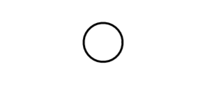 -> 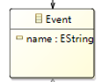

##### Activity

活动是公司在流程中执行的工作。 Activity 可以是原子的或非原子的（复合的）。 作为流程模型一部分的活动类型是：子流程和任务，它们是圆角矩形。 活动用于标准流程和编排

【关系】子流程和任务继承活动。

Activity Notation与元模型中元素的映射如下所示：

 -> 

##### Gateway

网关用于控制流程和编排中序列流的发散和收敛。因此，它将确定路径的分支、分叉、合并和连接。 内部标记将指示行为控制的类型。

【关系】分叉、合并继承网关

Gateway Notation与元模型中元素的映射如下所示：

 -> 

##### SequenceFlow

序列流用于显示活动将在流程和编排中执行的顺序

SequenceFlow Notation与元模型中元素的映射如下所示：

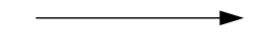 -> 

##### MessageFlow

消息流用于显示准备发送和接收消息的两个参与者之间的消息流。在 BPMN 中，协作图中的两个独立池将代表两个参与者（例如，PartnerEntities 和/或 PartnerRoles）。

【关系】序列流和消息流继承自流对象

MessageFlow Notation与元模型中元素的映射如下所示：

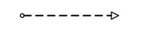 -> 

##### Association

关联用于将信息和工件与 BPMN 图形元素链接起来。 文本注释和其他工件可以与图形元素相关联。 在适当的时候，关联上的箭头表示流向（例如，数据）

Association Notation与元模型中元素的映射如下所示：

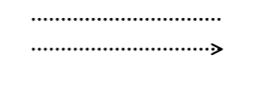 -> 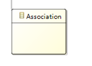

##### Pool

池是协作中参与者的图形表示。 它还充当“泳道”和图形,用于从其他池中划分一组活动的容器，通常在 B2B 情况下。 池可以具有内部详细信息，以将要执行的进程的形式。 或者一个池可能没有内部细节，即它可以是一个“黑匣子”。

Pool Notation与元模型中元素的映射如下所示：

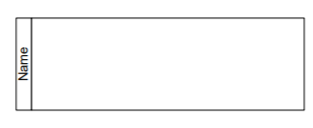 -> 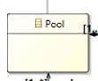

##### Lane

通道是进程中的子分区，有时在池中，并且会垂直或水平扩展进程的整个长度。 通道用于组织和分类活动。

Lane Notation与元模型中元素的映射如下所示：

 -> 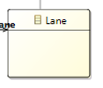

##### Data

数据对象提供有关需要执行什么活动和/或它们产生什么的信息，数据对象可以表示单个对象或对象集合。 数据输入和数据输出为进程提供相同的信息。

【关系】输入、输出继承自数据

Data Notation与元模型中元素的映射如下所示：

 -> 

##### Message

消息用于描述两个参与者之间的通信内容（由业务 PartnerRole 或业务 PartnerEntity 定义）。

Message Notation与元模型中元素的映射如下所示：

 -> 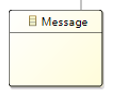

##### Group

组是同一类别内的一组图形元素。 这种类型的分组不会影响组内的序列流。 类别名称作为组标签出现在图表上。 类别可用于文档或分析目的。 组是在图表上可视化显示对象类别的一种方式。

Group Notation与元模型中元素的映射如下所示：

 -> 

##### TextAnnotation

文本注释是建模者为 BPMN 图的读者提供附加文本信息的一种机制.

TextAnnotation Notation与元模型中元素的映射如下所示：

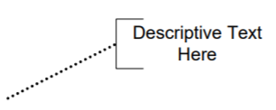 -> 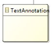

#### 其余拓展元素

##### Start&Intermediate&End

- 开始事件指示特定流程或编排将从何处开始。
- 中间事件发生在开始事件和结束事件之间。 它们将影响流程或编排（的流程，但不会启动或（直接）终止流程。
- 结束事件指示流程或编排将在哪里结束。

Start&Intermediate&End Notation与元模型中元素的映射如下所示：

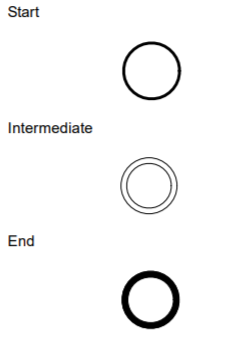 -> 

##### Task

任务是包含在流程中的原子活动。 当流程中的工作没有分解为更精细的流程细节级别时，将使用任务。

Task Notation与元模型中元素的映射如下所示：

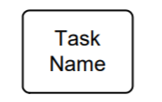 -> 

##### input&output

数据对象提供有关需要执行什么活动和/或它们产生什么的信息，数据对象可以表示单个对象或对象集合。 数据输入和数据输出
为进程提供相同的信息。

input&output Notation与元模型中元素的映射如下所示：

 -> 

##### Join

BPMN 使用术语“连接”来指将两个或多个并行路径合并为一个路径（也称为 AND-Join 或同步）。并行网关用于显示多个序列流的加入。

Join Notation与元模型中元素的映射如下所示：

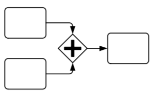 -> 

