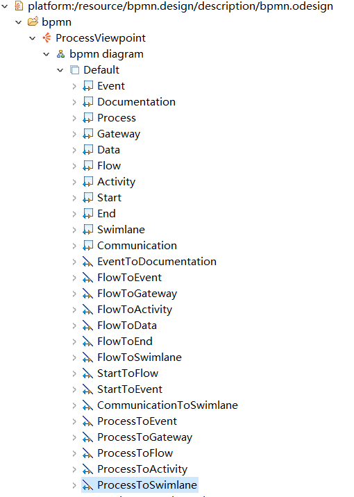

## 作业三 图形建模

//TODO不完整，周五前补充.md

### 模型截图

### 映射说明

截取元模型中的重要元素Event、Documentation、Process、Gateway、Data、Flow、Activity、Start、End、Swimlane、Communication映射成节点。

参考实际的BPMN图，建立流到各个主要元素的关系映射；同时，因为时间、活动、网关、活动、泳道是体现流程的重要组成部分，所以建立流程到它们的关系映射；泳道通过交流和其他组成部分交换信息，所以建立交流到泳道的的关系映射；开始节点意味着流程的开始，指向下一步事件，同时Start继承自Event，所以建立Start到Event的关系映射