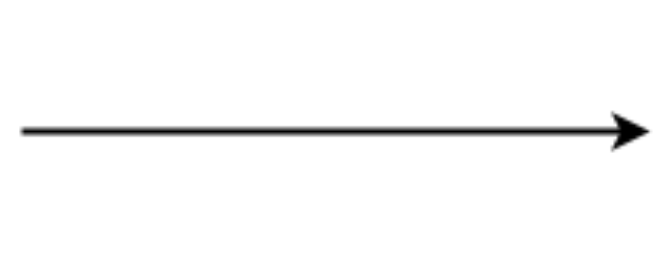

## 作业四：目标模型与 OMG 标准模型转换

SY2121113 任婷伊

### 详细说明

#### 转换内容

| BPMN       | activity diagram |    说明  |
| ---------- | ---------------- | ---- |
| Fork       | ForkNode         | 分叉 |
| Join       | JoinNode         | 合并 |
| FlowObject | ActivityEdge     | 流 |
| Decide     | DecisionNode     | 判断 |
| Process    | ActivityNode     | 活动节点 |
| Start      | InitialNode      | 开始 |
| End        | FinalNode        | 结束 |

#### 转换依据

|转化关系 | UML活动 | 活动图元素标识 | BPMN业务流程 | BPMN元素标识 |
| ---- | ---- | ---- | ---- | ---- |
|分叉 | Fork节点用于同时执行多个节点， |  |  设置为“并行”的网关节点可以将方向指定为“会聚”或“发散”，以在两种模式之间明确选择。  |  |
| 合并 | Join节点（使用相同的语法）用于等待所有传入流变为可用并离开单个流 |      | 设置为“并行”的网关节点用于显式建模多个节点的并发执行。它还用于等待所有传入流变为可用并离开一个流。 |       |
| 流 | 控制流用于连接活动图上的元素。一个显着的特征是，除了明确的Fork节点外，任何节点都只能遵循单个Control Flow。要限制控制流的流量，请添加一个Guard |      | 序列流用于连接业务流程图上的元素。这些与UML活动图的不同之处在于，默认情况下会采用所有有效的序列流。要限制序列流的流动，请将conditionType标记值设置为'Expression'并在conditionExpression标记值中创建脚本。 |        |
| 判断 | 决策节点用于显式地建模决策。当势流重新组合为一个时，将使用使用相同语法的合并节点 |      | 当必须选择单个路径时，将使用设置为“独占”的网关节点。它也用于再次组合势能流。可以将方向指定为“会聚”或“发散”，以在两种模式之间明确选择。 |      |
| 活动节点 | 活动操作呼叫行为操作 |      | 当需要在不参考外部活动的情况下进一步分解行为时，将活动元素设置为嵌入式子流程。 |      |
| 开始 | 起点由初始节点定义。没有指定为什么启动活动的方法 |      | 起点由开始事件定义。这暗示着活动开始的特定原因，尽管可能未指定。 |      |
| 结束 | 使用圆圈符号内的实心圆圈来表示状态机图中的最终状态。 一个系统或一个过程可以有多个最终状态 |         | 当特定过程或活动结束时系统达到的状态称为最终状态或结束状态。 |      |

### 结果演示

#### 输入模型元模型（BPMN业务流程图）

####  输出模型元模型（UML活动图）

#### 输入XMI

#### 输出XMI

#### 项目源码

见./ATL/任婷伊-SY2121113/ATL
