# 个人作业报告

SY2121113-任婷伊

## 作业一：BPMN

### BPMN简介

OMG开发了标准的业务流程模型和符号 (BPMN)，并借鉴了许多现有符号的专业知识和经验，比如UML 活动图、UML EDOC 业务流程、IDEF、ebXML BPSS、活动-决策流 (ADF) 图。

 BPMN 的主要目标是提供一种所有业务用户都易于理解的符号，包括创建流程初始草案的业务分析师、负责实现流程的技术开发人员，以及管理和监控流程的业务人员。因此，BPMN 为业务流程设计和流程实现之间的差距创建了一个标准化的桥梁。在面对许多不同的建模符号和观点时， BPMN 标准化了业务流程模型和符号，BPMN 将提供一种将流程信息传达给其他业务用户、流程实施者、客户和供应商的简单方法。

另一个同样重要的目标是确保设计用于执行业务流程的 XML 语言可以使用面向业务的符号进行可视化。

### BPMN用途

业务流程建模用于向各种各样的受众传达各种各样的信息。BPMN 旨在涵盖多种类型的建模，并允许创建端到端的业务流程。 BPMN 的结构元素使查看者能够轻松区分 BPMN 图表的各个部分。 端到端 BPMN 模型中有三种基本类型的子模型：

1. 流程（ Processes），包括：
   • 私有的不可执行（内部）业务流程
   • 私有可执行（内部）业务流程
   • 公共流程
2. 编排（Choreographies）
3. 协作（Collaborations），包括流程和/或编排
   • 对话视图

私有流程举例：

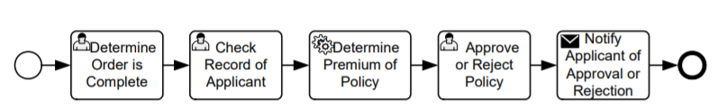

公共流程举例：

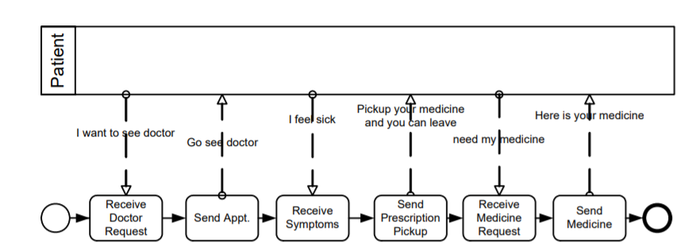

编排举例：

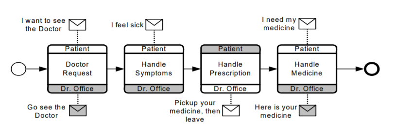

协作举例：

### BPMN图类型

BPMN 2.0 旨在涵盖流程的三个基本模型：私有流程（可执行和不可执行）、公共流程和编排。在这三个 BPMN 子模型之内和之间，可以创建多种类型的图表。以下是可以使用 BPMN 2.0 建模的业务流程示例：

- 高级非可执行流程活动（不是功能分解）
- 详细的可执行业务流程
- 原样或旧业务流程
-  未来或新的业务流程
-  对两（2）个或更多业务参与者之间预期行为的描述——编排。
- 详细的私有业务流程（可执行或不可执行）与一个或多个外部实体（或“黑匣子”流程）的交互
-  两个或更多详细的可执行进程交互
- 与编排的详细可执行业务流程关系
- 两个或多个公共进程
- 公共流程与编排的关系
-  通过编排进行交互的两个或更多详细的可执行业务流程

BPMN 旨在允许描述业务流程的所有上述示例。然而，不同子模型的组合方式留给了工具供应商。符合 BPMN 2.0 的实现可以建议建模者选择一个重点目标，例如私有流程或编排。但是，BPMN 2.0 规范不做任何假设。

### BPMN图元素

BPMN 发展的驱动力之一是创建一个简单易懂的机制来创建业务流程模型，同时能够处理业务流程固有的复杂性。处理这两个相互冲突的要求所采取的方法是将符号的图形方面组织到特定的类别中。这提供了一小组符号类别，以便 BPMN 图的读者可以轻松识别元素的基本类型并理解图。在元素的基本类别中，可以添加额外的变化和信息来支持复杂性的要求，而不会显着改变图表的基本外观和感觉。元素的五个基本类别是：

1. Flow Objects（定义业务流程行为）
   1. Events 
   2. Activities 
   3.  Gateways
2. Data
   1. Data Objects 
   2. Data Inputs 
   3. Data Outputs 
   4.  Data Stores
3. Connecting Objects（连接Flow Objects）
   1. Sequence Flows
   2. Message Flows 
   3. Associations 
   4. Data Associations
4. Swimlanes（对主要建模元素进行分组）
   1. Pools
   2. Lanes
5. Artifacts（提供有关流程的附加信息）
   1.  Group
   2.  Text Annotation

### BPMN图举例

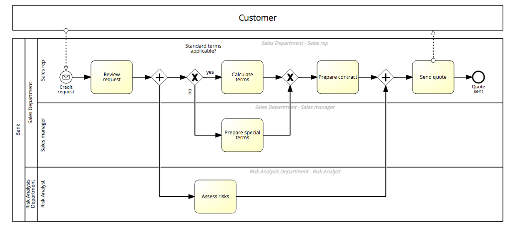

## 作业二：BPMN元模型 

### 元模型图

### 元素构成及关系

【关系】BPMN体现业务流程，所以Process为根节点。事件、网关、数据、流、泳池通道、活动等用于体现业务流程，是重要的一部分，所以是组合关系

#### 基本元素

##### Event

事件是在流程或编排过程中“发生”的事情。 这些事件影响模型的流程，通常有原因（触发）或影响（结果）。 事件用圆圈表示，以允许内部标记区分不同的触发或结果。 根据它们影响流的时间，有三种类型的事件：开始、中间和结束。

【关系】开始、中间和结束继承事件

Event Notation与元模型中元素的映射如下所示：

 -> 

##### Activity

活动是公司在流程中执行的工作。 Activity 可以是原子的或非原子的（复合的）。 作为流程模型一部分的活动类型是：子流程和任务，它们是圆角矩形。 活动用于标准流程和编排

【关系】子流程和任务继承活动。

Activity Notation与元模型中元素的映射如下所示：

 -> 

##### Gateway

网关用于控制流程和编排中序列流的发散和收敛。因此，它将确定路径的分支、分叉、合并和连接。 内部标记将指示行为控制的类型。

【关系】分叉、合并继承网关

Gateway Notation与元模型中元素的映射如下所示：

 -> 

##### SequenceFlow

序列流用于显示活动将在流程和编排中执行的顺序

SequenceFlow Notation与元模型中元素的映射如下所示：

 -> 

##### MessageFlow

消息流用于显示准备发送和接收消息的两个参与者之间的消息流。在 BPMN 中，协作图中的两个独立池将代表两个参与者（例如，PartnerEntities 和/或 PartnerRoles）。

【关系】序列流和消息流继承自流对象

MessageFlow Notation与元模型中元素的映射如下所示：

 -> 

##### Association

关联用于将信息和工件与 BPMN 图形元素链接起来。 文本注释和其他工件可以与图形元素相关联。 在适当的时候，关联上的箭头表示流向（例如，数据）

Association Notation与元模型中元素的映射如下所示：

 -> 

##### Pool

池是协作中参与者的图形表示。 它还充当“泳道”和图形,用于从其他池中划分一组活动的容器，通常在 B2B 情况下。 池可以具有内部详细信息，以将要执行的进程的形式。 或者一个池可能没有内部细节，即它可以是一个“黑匣子”。

Pool Notation与元模型中元素的映射如下所示：

 -> 

##### Lane

通道是进程中的子分区，有时在池中，并且会垂直或水平扩展进程的整个长度。 通道用于组织和分类活动。

Lane Notation与元模型中元素的映射如下所示：

 -> 

##### Data

数据对象提供有关需要执行什么活动和/或它们产生什么的信息，数据对象可以表示单个对象或对象集合。 数据输入和数据输出为进程提供相同的信息。

【关系】输入、输出继承自数据

Data Notation与元模型中元素的映射如下所示：

 -> 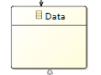

##### Message

消息用于描述两个参与者之间的通信内容（由业务 PartnerRole 或业务 PartnerEntity 定义）。

Message Notation与元模型中元素的映射如下所示：

 -> 

##### Group

组是同一类别内的一组图形元素。 这种类型的分组不会影响组内的序列流。 类别名称作为组标签出现在图表上。 类别可用于文档或分析目的。 组是在图表上可视化显示对象类别的一种方式。

Group Notation与元模型中元素的映射如下所示：

 -> 

##### TextAnnotation

文本注释是建模者为 BPMN 图的读者提供附加文本信息的一种机制.

TextAnnotation Notation与元模型中元素的映射如下所示：

 -> 

#### 其余拓展元素

##### Start&Intermediate&End

- 开始事件指示特定流程或编排将从何处开始。
- 中间事件发生在开始事件和结束事件之间。 它们将影响流程或编排（的流程，但不会启动或（直接）终止流程。
- 结束事件指示流程或编排将在哪里结束。

Start&Intermediate&End Notation与元模型中元素的映射如下所示：

 -> 

##### Task

任务是包含在流程中的原子活动。 当流程中的工作没有分解为更精细的流程细节级别时，将使用任务。

Task Notation与元模型中元素的映射如下所示：

 -> 

##### input&output

数据对象提供有关需要执行什么活动和/或它们产生什么的信息，数据对象可以表示单个对象或对象集合。 数据输入和数据输出
为进程提供相同的信息。

input&output Notation与元模型中元素的映射如下所示：

 -> 

##### Join

BPMN 使用术语“连接”来指将两个或多个并行路径合并为一个路径（也称为 AND-Join 或同步）。并行网关用于显示多个序列流的加入。

Join Notation与元模型中元素的映射如下所示：

 -> 

## 目标模型图形建模：元模型对应图符及映射关系、建模工具 

元模型和图形建模，需包含模型截图、映射关系说明、源码及视频演示链接

TODO下次补充

## 作业四：目标模型与 OMG 标准模型转换

### 详细说明

#### 转换内容

| BPMN       | activity diagram |    说明  |
| ---------- | ---------------- | ---- |
| Fork       | ForkNode         | 分叉 |
| Join       | JoinNode         | 合并 |
| FlowObject | ActivityEdge     | 流 |
| Decide     | DecisionNode     | 判断 |
| Process    | ActivityNode     | 活动节点 |
| Start      | InitialNode      | 开始 |
| End        | FinalNode        | 结束 |

#### 转换依据

|转化关系 | UML活动 | 活动图元素标识 | BPMN业务流程 | BPMN元素标识 |
| ---- | ---- | ---- | ---- | ---- |
|分叉 | Fork节点用于同时执行多个节点， |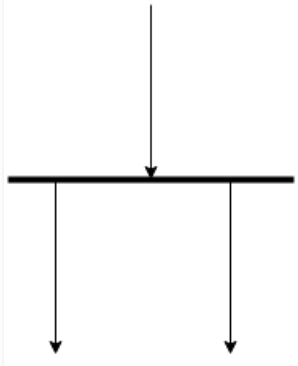  |  设置为“并行”的网关节点可以将方向指定为“会聚”或“发散”，以在两种模式之间明确选择。  | 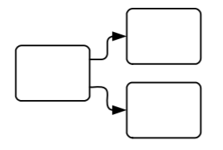 |
| 合并 | Join节点（使用相同的语法）用于等待所有传入流变为可用并离开单个流 |     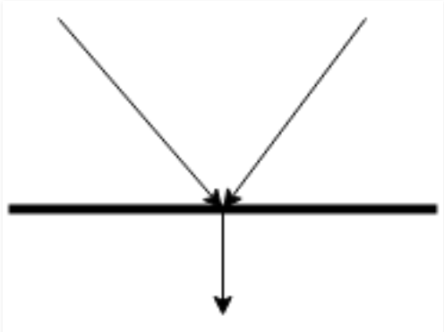 | 设置为“并行”的网关节点用于显式建模多个节点的并发执行。它还用于等待所有传入流变为可用并离开一个流。 |       |
| 流 | 控制流用于连接活动图上的元素。一个显着的特征是，除了明确的Fork节点外，任何节点都只能遵循单个Control Flow。要限制控制流的流量，请添加一个Guard |      | 序列流用于连接业务流程图上的元素。这些与UML活动图的不同之处在于，默认情况下会采用所有有效的序列流。要限制序列流的流动，请将conditionType标记值设置为'Expression'并在conditionExpression标记值中创建脚本。 |        |
| 判断 | 决策节点用于显式地建模决策。当势流重新组合为一个时，将使用使用相同语法的合并节点 |      | 当必须选择单个路径时，将使用设置为“独占”的网关节点。它也用于再次组合势能流。可以将方向指定为“会聚”或“发散”，以在两种模式之间明确选择。 |      |
| 活动节点 | 活动操作呼叫行为操作 |  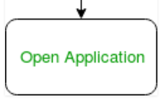    | 当需要在不参考外部活动的情况下进一步分解行为时，将活动元素设置为嵌入式子流程。 |      |
| 开始 | 起点由初始节点定义。没有指定为什么启动活动的方法 |      | 起点由开始事件定义。这暗示着活动开始的特定原因，尽管可能未指定。 |      |
| 结束 | 使用圆圈符号内的实心圆圈来表示状态机图中的最终状态。 一个系统或一个过程可以有多个最终状态 |         | 当特定过程或活动结束时系统达到的状态称为最终状态或结束状态。 |      |

### 结果演示

#### 输入模型元模型（BPMN业务流程图）

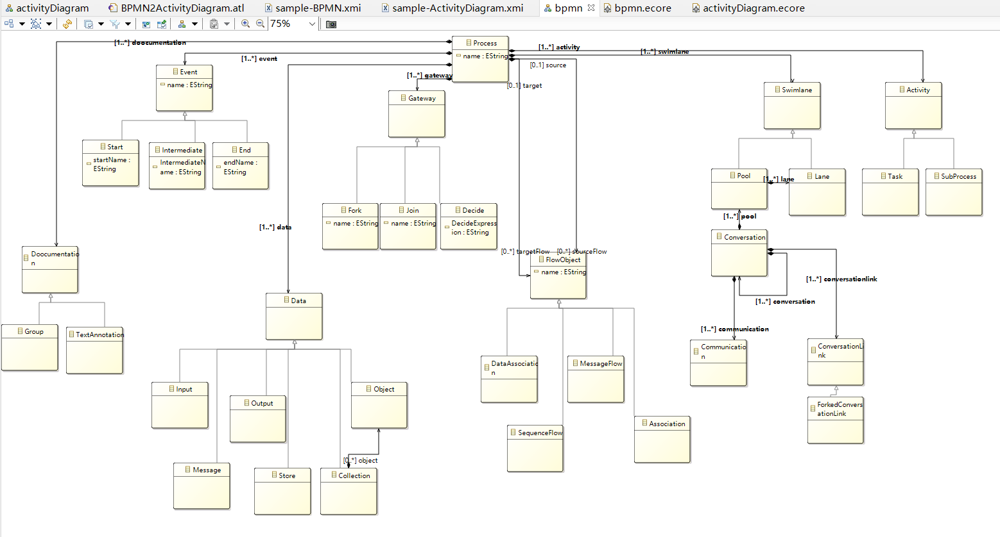

####  输出模型元模型（UML活动图）

#### 输入XMI

#### 输出XMI

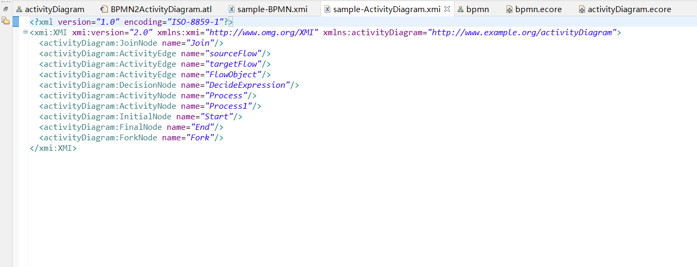

#### 项目源码

见./ATL/任婷伊-SY2121113/ATL
