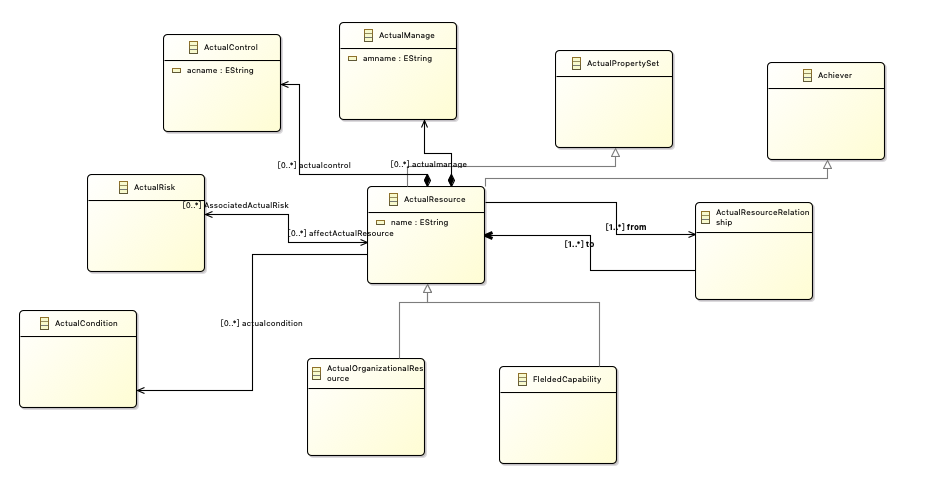
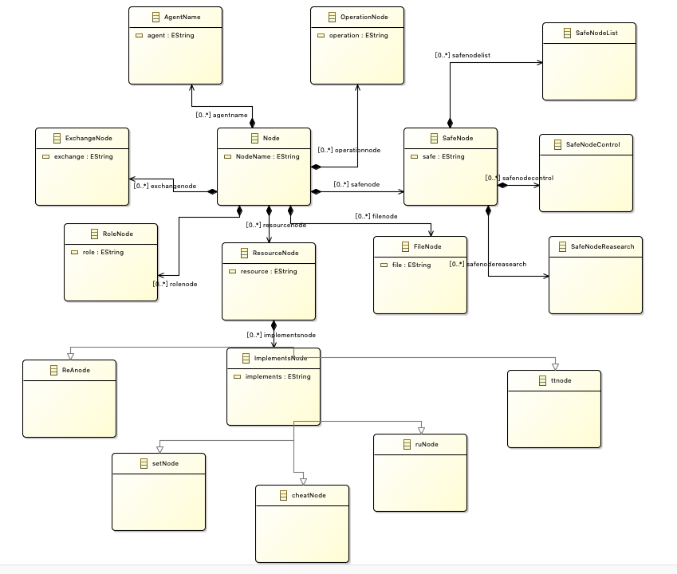
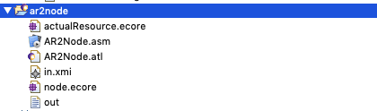
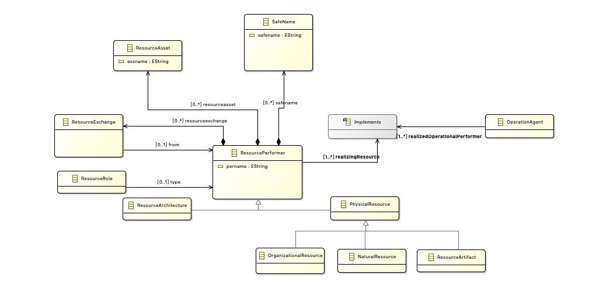
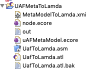
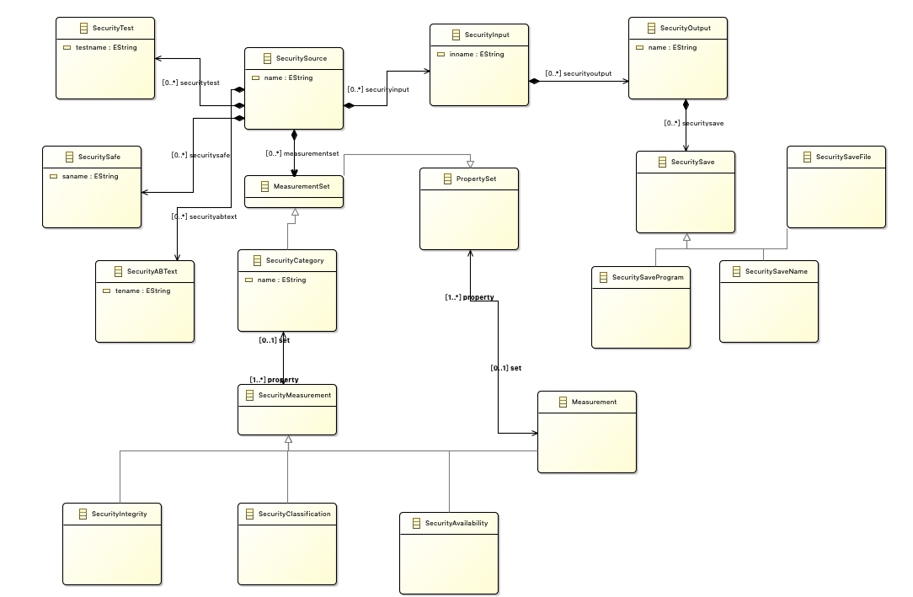
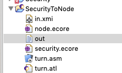

# 结果演示

SY2121110 刘炜

## 输入模型元模型（ActualResource业务流程图）

##  输出模型元模型（ActualResourceUML活动图）

### 输入XMI

### 输出XMI

## 项目源码

## 输入模型元模型（uaf业务流程图）

##  输出模型元模型（uaf活动图）

### 输入XMI

### 输出XMI

## 项目源码

## 输入模型元模型（security业务流程图）

##  输出模型元模型（security活动图）

### 输入XMI

### 输出XMI

## 项目源码
