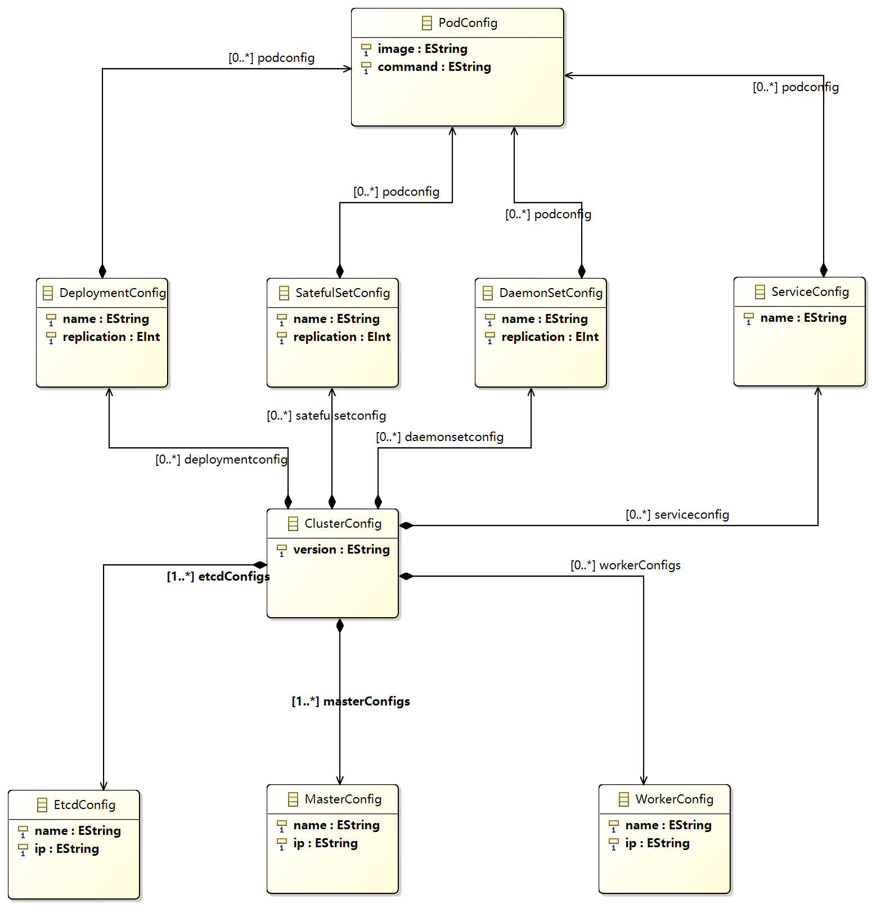
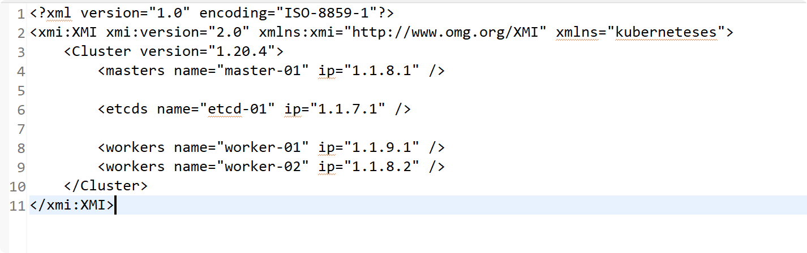

# 李楠-SY2121108-个人作业报告

## 目标系统（Kubernetes）简介

Kubernetes是一个用于管理大量容器运行的集群工具。它可以快速启动大量容器、监控它们的运行状态，并使用统一的形式对外提供服务。

## 元模型及建模思路

Kubernetes集群由多个节点（node）组成，每个节点都是一台物理意义上独立的机器。Kubernetes的任务就是将容器（Container）包装成Pod，然后调度在各个节点上执行。节点根据自己的角色不同，分为Master、Etcd、Worker等三种角色，每个节点上会根据角色的不同，包含kubelet、kubeproxy、apiServer等组件。

除此之外，Pod还会收到一些Controller的管理。这些Controller是一些虚拟概念，主要分为DaemonSet、StatefulSet、Deployment、Job等几种。为了对外提供服务，Kubernetes会创建Service将Pod中容器的端口暴露给外界。

## 图形建模

截图：

演示视频链接：

[图形建模演示视频](图形建模/Sirius-1.mp4)

代码链接：

[图形建模代码链接](图形建模/k8S.design)

## 模型转换

最终的模型转换作业的输出模型为经过裁剪的Kubernetes元模型，输出模型为Kubernetes配置文件的元模型。

### 输入端元模型截图

### 输出端元模型截图

在配置文件元模型中，采用的是嵌套的YAML文件的形式。

该嵌套YAML文件中，最顶层是cluster的声明，紧接着是对集群中各个节点（node）的声明。

与节点（node）的配置声明位于统一层次的是各个controller的声明，在controller的声明中又会包含对具体的pod的配置声明。

### 输入模型截图

### 输出模型截图

### ATL代码

[ATL代码链接](模型转换/kuberentes2Configfile.atl)