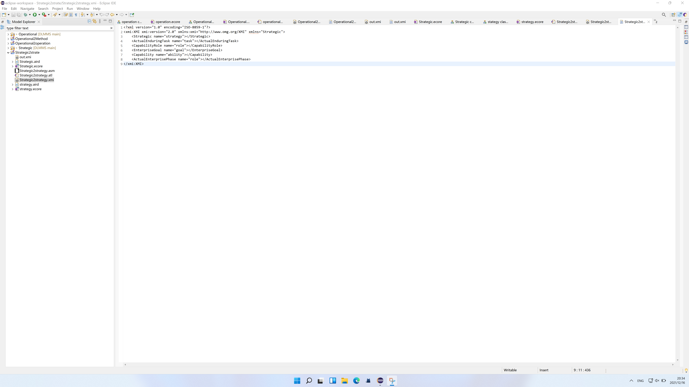

# 元模型介绍
1、Operational : 即整个企业/架构操作性相关的类别
2、Strategic : 即整个企业/架构的整体战略

## 目标元模型1：Operational
### 元模型

说明：此元模型设计思路如下：
作为根节点，我设计了一系列的聚合子类，即可以理解Operational包含一系列的类，如下：
1、OperationalArchitecture：操作的整体架构
2、OperationalMethod：操作需要使用的方法细类
3、OperationalPerformer：操作的执行人员
4、OperationalRole：在本次操作中的一些列可供角色
5、OperationalParameters：本次操作中的一些列方法参数
此外还有一系列的relation：
1、hasParameters：操作方法类会包含一系列的操作方法参数类
2、hasRole：操作人员类会包含一系列的操作角色类
以及一系列的聚合关系
3、operationalArchitecture
4、operationalMethod
5、operationalPerformer
6、operationalRole
7、operationalParameters
#### 具体的代码文件[here](https://github.com/BUAASuperSE/DLMMS/tree/main/%E7%8E%8B%E5%AD%90%E5%8B%A4-SY2121117/Operational)
### 转换为Sirius的画图结果
截图：

视频：

<video width="320" height="240" controls>
  <source src="../../../Sirius-design/王子勤-SY2121117/录屏.mov" type="video/mp4">
</video>

#### 具体的代码文件[here](https://github.com/BUAASuperSE/DLMMS/tree/main/Sirius-design/%E7%8E%8B%E5%AD%90%E5%8B%A4-SY2121117)
### 模型转换ATL

说明：模型转换思路较为简单，将一个Operational特属的类别转换为一个对应的泛用子类，具体设计（映射）如下：
OperationalArchitecture --> architecture
OperationalMethod --> method
OperationalPerformer --> performer
OperationalRole --> role
OperationalParameters --> parameters
#### 转换视频如下
<video width="320" height="240" controls>
  <source src="./Operational/Operational2operation.mov" type="video/mp4">
</video>
#### 输入xmi如下

#### 输出xmi如下

#### 具体的代码文件[here](https://github.com/BUAASuperSE/DLMMS/tree/main/%E5%9B%A2%E9%98%9F%E4%BD%9C%E4%B8%9A%E4%B8%8E%E4%B8%AA%E4%BA%BA%E4%BD%9C%E4%B8%9A%E6%9C%80%E7%BB%88%E6%8A%A5%E5%91%8A/%E4%B8%AA%E4%BA%BA%E4%BD%9C%E4%B8%9A%E6%9C%80%E7%BB%88%E6%8A%A5%E5%91%8A/%E7%8E%8B%E5%AD%90%E5%8B%A4-SY2121117_%E4%B8%AA%E4%BA%BA%E4%BD%9C%E4%B8%9A%E6%9C%80%E7%BB%88%E6%8A%A5%E5%91%8A/Operational/ATL/Operational2operation)

## 目标元模型2：Strategic
### 元模型

说明：此元模型设计思路如下：
作为根节点，我设计了一系列的聚合子类，即可以理解Strategic包含一系列的类，如下：
1、EnterpriseGoal：这次战略中的整体目标
2、ActualEnterprisePhase：这次战略中企业（战略团体）的生存阶段，即不同的阶段要有不同的战略任务以及对应的预期结果
3、ActualEnterpriseTask：这次战略中企业（战略团体）的具体任务，根据生存阶段的不同会有不同的任务
4、Capability：本次战略需要的特定技能/能力
5、CapabilityRole：本次战略中的特定人员，包含了拥有的技能/能力
此外还有一系列的relation：
1、hasPhase：战略中企业（战略团体）的每个具体任务都会有阶段属性
2、hasAbility：战略特定人员会包括一定的特定技能
以及一系列的聚合关系
3、enterpriseGoal
4、actualEnterprisePhase
5、AactualEnterpriseTask
6、capability
7、capabilityRole
#### 具体的代码文件[here](https://github.com/BUAASuperSE/DLMMS/tree/main/%E7%8E%8B%E5%AD%90%E5%8B%A4-SY2121117/Strategic)
### 转换为Sirius的画图结果
截图：

视频：

<video width="320" height="240" controls>
  <source src="../../../Sirius-design/王子勤-SY2121117/录屏.mov" type="video/mp4">
</video>

#### 具体的代码文件[here](https://github.com/BUAASuperSE/DLMMS/tree/main/Sirius-design/%E7%8E%8B%E5%AD%90%E5%8B%A4-SY2121117)
### 模型转换ATL

说明：模型转换思路较为简单，将一个Strategic特属的类别转换为一个对应的泛用子类，具体设计（映射）如下：
EnterpriseGoal --> goal
ActualEnterprisePhase --> phase
ActualEnterpriseTask --> task
Capability --> ability
CapabilityRole --> role
#### 转换视频如下
<video width="320" height="240" controls>
  <source src="./Strategic/Strategic2strategy.mov" type="video/mp4">
</video>
#### 输入xmi如下

#### 输出xmi如下

#### 具体的代码文件[here](https://github.com/BUAASuperSE/DLMMS/tree/main/%E5%9B%A2%E9%98%9F%E4%BD%9C%E4%B8%9A%E4%B8%8E%E4%B8%AA%E4%BA%BA%E4%BD%9C%E4%B8%9A%E6%9C%80%E7%BB%88%E6%8A%A5%E5%91%8A/%E4%B8%AA%E4%BA%BA%E4%BD%9C%E4%B8%9A%E6%9C%80%E7%BB%88%E6%8A%A5%E5%91%8A/%E7%8E%8B%E5%AD%90%E5%8B%A4-SY2121117_%E4%B8%AA%E4%BA%BA%E4%BD%9C%E4%B8%9A%E6%9C%80%E7%BB%88%E6%8A%A5%E5%91%8A/Strategic/ATL/Strategic2strate)