## 个人作业报告

SY2121101 陈泽人

### 目标模型简介

统一体系架构框架（Unified Architecture Framework，UAF）是对象管理组织（Object Management Group，OMG）于2017年11月发布的体系架构标准，标志着体系架构技术进入了全新的发展阶段。UAF将贯穿系统全生命周期的需求管理为驱动，元模型为支撑，利用统一建模语言（Unified Modeling Language，UML）/系统建模语言（System Modeling Language，SysML）进行面向对象的设计。UAF结合系统、资源、业务等各方面要素，提供更细致合理、逻辑关系更紧密的面向对象分解的视图矩阵，将组织体系划分为战略（Strategic）、资源（Resource）、人力（Personnel）等多个领域，见图1。

图1 UAF模型框架

本次作业中主要设计3个模型：

* 人力 - **Personnel**：定义了组织的资源类型，包括组织资源的拓扑结构、组织资源间的交互和随时间的增长；

* 服务 - **Service**：对操作模型（Operational）中描述的所需要的服务的描述，服务可以被理解为一个工作单元，提供者通过它象消费者提供有价值的结果；

* 信息 - **Information**：在操作模型（Operational）、服务模型（Service）和资源模型（Resource）间提供信息交互。

### Personnel

#### 元模型及其图形建模

**裁剪**

将Personnel具象化为一个公司的组织结构，保留了其中的不同部门、职员、董事会等，通过Personnel模型展示出一个树状的公司组织资源架构。

**元模型 - 第一次迭代**

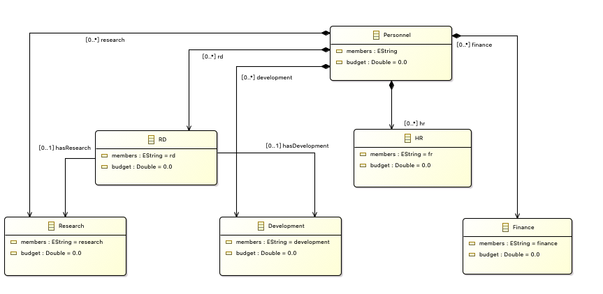

**图形建模 - 对应元模型第一次迭代**

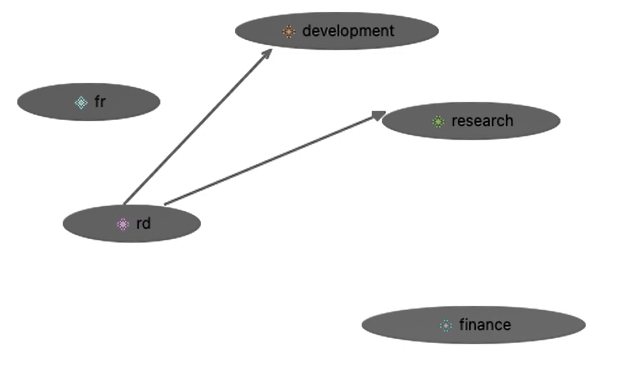

所有图形建模操作视频见 [odesign操作.mov](assets/odesign操作.mov)

#### 模型转换

**目标模型 - 元模型第二次迭代**

第二次迭代中进一步将第一次迭代中不同的部门抽象成Department类以及Department中的Employee类，并多加了Board和Director类。Employee类和Director类分别从属Department类和Board类，表示部门下的职员和董事会成员。

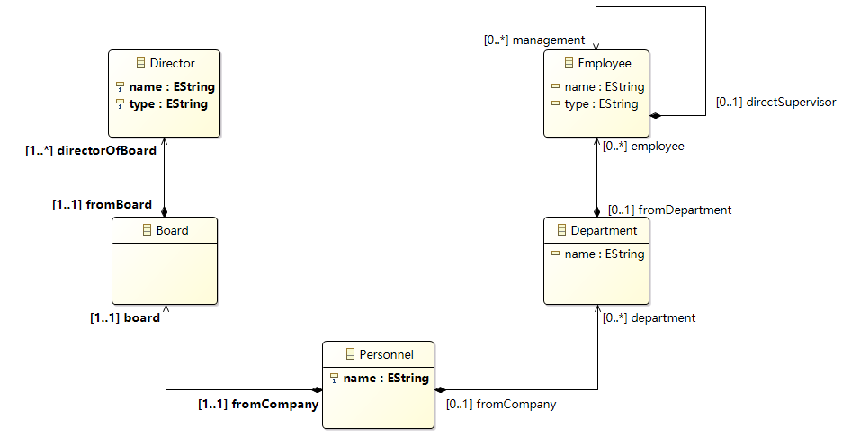

**转换模型**

将树状结构的Personnel类转换成扁平的人员结构Person，包括DirectorOfBoard类、DevelopmentEmployee、HREmployee和FinanceEmployee。

**输入**

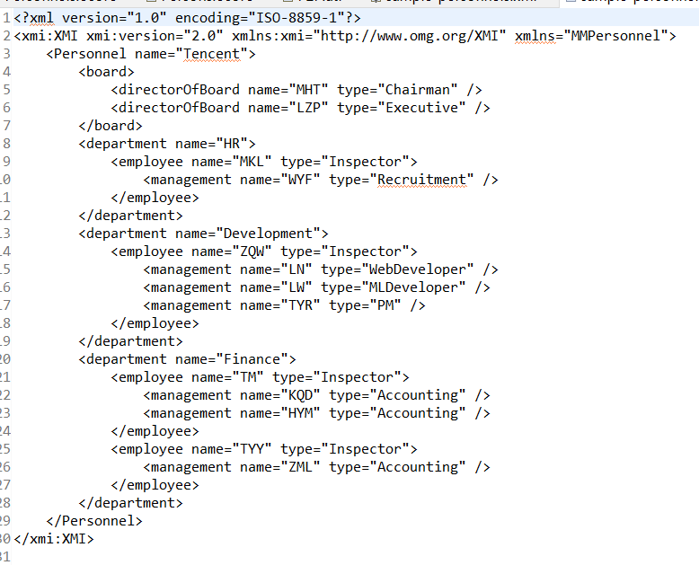

**输出**

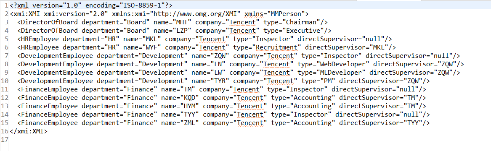

转换脚本见 [P2P.atl](personnel/atl/personnel2person/P2P.atl)

转换视频见 [personnel2person.mp4](personnel/atl/personnel2person.mp4)

### Service

#### 元模型及其图形建模

**裁剪**

将Service具象化到一个实际的业务场景，比如团队作业中的深度学习模型管理平台，在该平台中Service根据Operational模型中的执行策略，整合不同的Resource进行执行，交付有价值的结果。

**元模型 - 第一次迭代**

**图形建模 - 对应元模型第一次迭代**

所有图形建模操作视频见 [odesign操作.mov](assets/odesign操作.mov)

#### 模型转换

**目标模型 - 元模型第二次迭代**

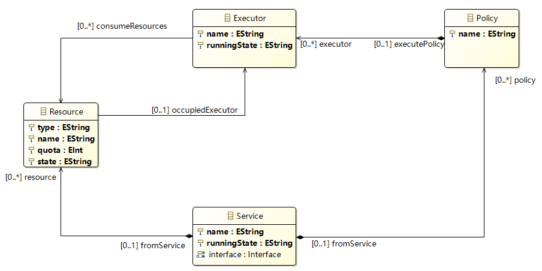

**转换模型**

将树状结构的Service类转换成不同部分的Controller，包括硬件Controller：StorageController、CPUController和GPUController，以及软件Controller：ExecutorController和InterfaceController。

**输入**

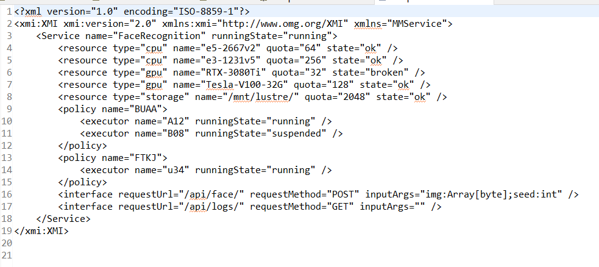

**输出**

转换脚本见 [S2C.atl](service/atl/service2controller/S2C.atl)

转换视频见 [service2controller.mp4](service/atl/service2controller.mp4)

### Information

#### 元模型及其图形建模

**裁剪**

对Information保留最基础的建模，包括收发消息的人、不同类型的消息。

**元模型 - 第一次迭代**

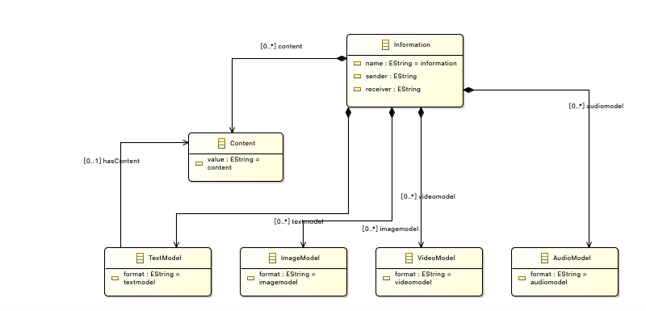

**图形建模 - 对应元模型第一次迭代**

所有图形建模操作视频见 [odesign操作.mov](assets/odesign操作.mov)

#### 模型转换

**目标模型 - 元模型第二次迭代**

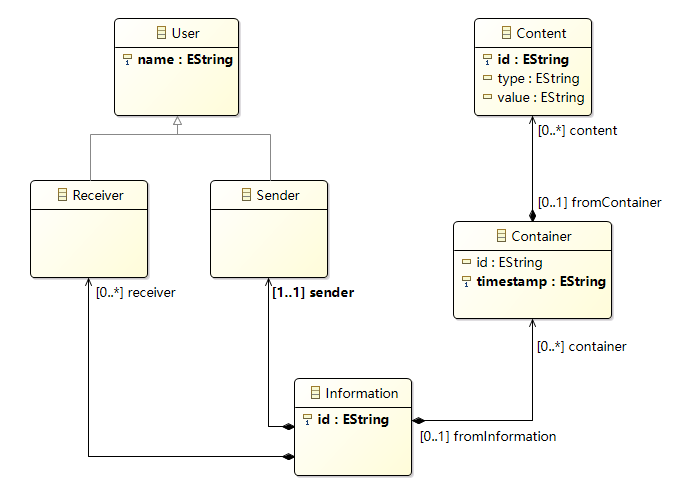

**转换模型**

将树状结构的Information类转换成扁平的Message类，因为每个Information包括多个receiver，因此该转换中设计collection操作，转换后的Message可能包含一个或多个Receiver。

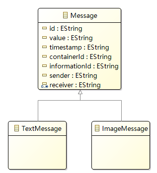

**输入**

**输出**

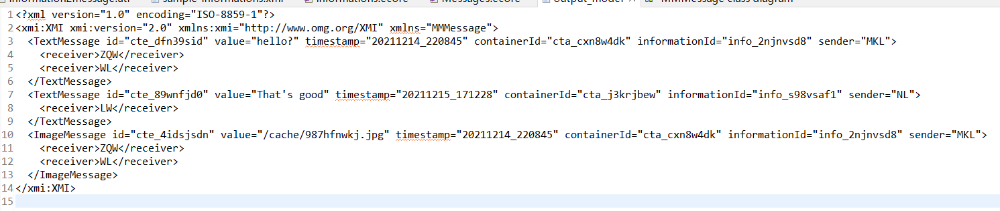

转换脚本见 [information2message.atl](information/atl/information2message/information2message.atl)

转换视频见 [information2message.mp4](information/atl/information2message.mp4)
