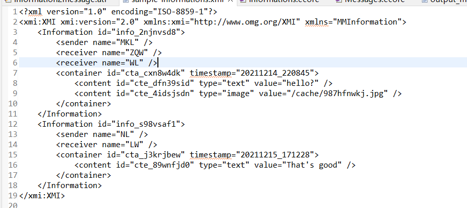

## 个人作业报告

SY2121101 陈泽人

### 目标模型简介

**Personnel**：整体组织架构，包括部门、人员等

**Service**：服务，包括运行时资源、执行程序以及服务运行策略等

**Infomation**：传递信息，包括不同类别的信息、信息的收发等

### 元模型

#### Personnel

**第一次迭代**

**第二次迭代**

第一次迭代把整体组织的部分列了出来，但不够抽象，因此再第二次迭代中进一步将不同的部门抽象成Department类以及Department中的Employee类，并多加了Board和Director类。Employee类和Director类分别从属Department类和Board类，表示部门下的职员和董事会成员。

#### Service

**第一次迭代**

**第二次迭代**

#### Information

**第一次迭代**

**第二次迭代**

### 图形建模

#### Personnel

#### Service

#### Information

### 模型转换

#### Personnel to Person

**目标模型**

**转换模型**

将树状结构的Personnel类转换成扁平的人员结构Person，包括DirectorOfBoard类、DevelopmentEmployee、HREmployee和FinanceEmployee

**输入**

**输出**

#### Service to ComponentController

**目标模型**

**转换模型**

将树状结构的Service类转换成不同部分的Controller，包括硬件Controller：StorageController、CPUController和GPUController，以及软件Controller：ExecutorController和InterfaceController

**输入**

**输出**

#### Information to Message

**目标模型**

**转换模型**

将树状结构的Information类转换成扁平的Message类，因为每个Information包括多个receiver，因此该转换中设计collection操作，转换后的Message可能包含一个或多个Receiver

**输入**

**输出**

